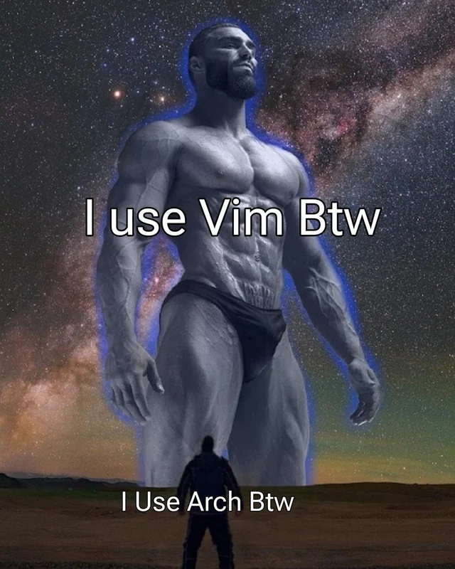

<!-- _class: lead -->
# An Introduction to Vim
### James Beasley-Gard

---
<style scoped>
    h3, p {
        font-size: 70%;
    }
</style>
# Background
### ed (1975 c. Ken Thompson)
Edit files using commands with **no visual feedback**.

### vi (1976 c. Bill Joy)
Text editor that let you see the text you were editing 🤯
Included by default in most UNIX-like systems.

### vim (1991 c. Bram Moolenaar)
Vi iMproved. Huge amount of enhancements including syntax highlighting, plugin support, mouse integration, comprehensive help system...

### neovim (2015 c. Neovim Team)
Fork of Vim that supports the Language Server Protocol, asynchronous I/O and Lua scripting.

---
# Setting Up Neovim
Install:
```
snap install nvim --classic
```

Run:
```
nvim <file>
```

---
# Why learn Vim?
+ When you don't have access to a GUI (e.g. ssh'ing into a remote server) or it's inconvenient to leave the command line.
+ Quickly edit one file without needing to wait for a fully featured IDE to open and analyze the entire containing directory/project
+ Vim bindings are so popular that [tons of programs](https://github.com/erikw/vim-keybindings-everywhere-the-ultimate-list) add Vim modes for more efficient use

---
<style scoped>
    p {
        text-align: center;
        font-size: 200%;
    }
</style>
# Why use Vim?



---
# Why use Vim instead of VS Code?

---

# Why use Vim instead of VS Code?
### **Don't!**
+ Only use Vim if it makes the specific task you're doing more convenient. Vim can be effective as a lightweight support for a fully-featured IDE.
+ You can also [integrate Vim](https://marketplace.visualstudio.com/items?itemName=vscodevim.vim) ([or NeoVim](https://marketplace.visualstudio.com/items?itemName=asvetliakov.vscode-neovim)) into VS Code as an editor mode!


---
# Modes

**Normal Mode**
*Editor chords*

**Insert Mode**
*Insert text*

**Command-line Mode**
*Input* ```:``` *commands*


---
<!-- _class: lead -->
# Command Line Mode

---
# Bare Bones Basics
### Saving and/or Exiting

```:wq``` Save and exit
```:x``` Alias for :wq

```:q!``` Discard changes and quit

```:w !sudo tee %``` Write to current file using sudo

---
<!-- _footer: :help options -->
# Customizing Your Editor
+ ```:set nu``` Turn on line numbers
+ ```:set rnu``` Turn on relative line numbers
+ ```:set linebreak``` Ensure line wrap doesn't split words
+ ```:set autoindent``` Keep created new lines consistent with indentation of previous lines
+ To undo any of these commands, add a ```!``` to the end of them, e.g. ```:set rnu!```
+ To make sure your customizations apply each time you open neovim, create a file at ~/.config/nvim/init.vim

---
<!-- _class: lead -->
# Getting Around in Normal Mode

---
<style scoped>
    p {
        text-align: center;
        font-size: 200%;
    }
</style>
# Bare Bones Basics
### Basic Motions
← ↓ ↑ →
```h```  ```j```  ```k```  ```l```

---
<!-- _footer: :help motions -->
# Bare Bones Basics

### Basic Motions
+ ```gg``` and ```G``` go to start of or end of file
+ ```0``` and ```$``` go to start of or end of line
+ ```F<char>``` and ```f<char>``` go to previous or next occurance of char in file
+ ```T<char>``` and ```t<char>``` go *until* previous or next occurance of char in file

--- 
<!-- _footer: :help motions -->
# Bare Bones Basics

### Basic Motions
+ ```e``` go to end of current/closest word
+ ```b``` go to beginning of current/closest previous word
---
<!-- _footer: :help search -->
# Bare Bones Basics

### Searching
+ ```/word``` will search for all occurances of 'word' in your file, placing your cursor at the next occurance
+ ```?word``` will search *backward* for all occurances of 'word' in your file, placing your cursor at the previous occurance
&nbsp;
+ ```n``` to go to next word in search direction
+ ```N``` to go to previous word in search direction

---
<!-- _class: lead -->
# Normal Mode Chords
*"Vim's killer feature is the language it provides for making changes"*

operator [modifier] object
*verb [modifier] noun*

---
<!-- _footer: :help operator -->
# Important Operators

+ ```d``` delete
+ ```c``` change
+ ```<``` and ```>``` unindent and indent
+ ```y``` yank
+ ```v``` select in visual mode

---
<!-- _footer: :help text-object -->
<div class="columns">
<div>
<h2>Text Objects</h2>

+ ```l``` character
+ ```w``` word
+ ```s``` sentence
+ ```p``` paragraph
+ ```t``` HTML tag
</div>
<div>
<h2>Modifiers</h2>

+ ```i``` inside text object
+ ```a``` around a text object
&nbsp;
+ Modifiers also work with specific characters, e.g:
    + ```di(``` Delete all text inside parentheses
    + ```da"``` Delete whole string, including quote marks
</div>
</div>

---
<!-- _footer: :help repeating -->
# Repeatable and Undoable

+ ```.``` Execute last (non-navigation) command
+ ```<n><command>``` Adding a number before a command will repeat the command that many times, e.g. ```4>l``` will indent 4 lines
&nbsp;
+ ```u``` Undo last command
+ ```Ctrl+r``` Redo undone command

---
# Motions as Text Objects
+ Motions will translate into text objects that contain all the text the cursor passed through while completing
+ Examples (What would these do?):
    + ```df"```
    + ```c$```
    + ```y2e```

---
<!-- _class: lead -->
# Getting into Insert Mode

---
<!-- _footer: :help inserting -->
# On the cursor
+ ```i``` Insert mode before cursor
+ ```a``` Insert mode after cursor
+ ```r``` Quick replace character at cursor

---
<!-- _footer: :help inserting -->
# On a line
+ ```I``` Insert mode at start of line
+ ```A``` Insert mode at end of line
+ ```o``` Create new line below current line and insert
+ ```O``` Create new line above current line and insert

---
# Sources and Further Reading

+ [Mastering the Vim Language - Chris Toomey (Video)](https://www.youtube.com/watch?v=wlR5gYd6um0)
+ [Vim, with Vigor - William E. Shotts, Jr](https://linuxcommand.org/lc3_adv_vimvigor.php)
+ Vim Reference Manual - Bram Moolenaar (:help reference)
 + Vim Cheat Sheets:
    + [vim.rtorr.com](https://vim.rtorr.com)
    + [devhints.io/vim](https://devhints.io/vim)
